# Dotfiles Architecture

<!-- architecture-toc:start -->
## Table of Contents

- [Overview](#overview)
  - [Purpose](#purpose)
- [Technology Stack](#technology-stack)
- [Repository Structure](#repository-structure)
- [System Context](#system-context)
- [Components](#components)
  - [Nix configuration and activation](#nix-configuration-and-activation)
  - [Convention linker](#convention-linker)
  - [Shell and environment profiles](#shell-and-environment-profiles)
  - [Synchronization](#synchronization)
  - [Credential tools](#credential-tools)
- [Dependencies](#dependencies)
- [Runtime and Data Flows](#runtime-and-data-flows)
- [APIs and Contracts](#apis-and-contracts)
- [Persistence and Data Model](#persistence-and-data-model)
- [Integrations](#integrations)
- [Security Boundaries](#security-boundaries)
- [Infrastructure](#infrastructure)
- [Deployment](#deployment)
- [CI/CD](#cicd)
- [Testing](#testing)
- [Runtime and Build Processes](#runtime-and-build-processes)
- [Operations](#operations)
- [Architecture Decisions](#architecture-decisions)
  - [Declarative configuration with explicit escape hatches](#declarative-configuration-with-explicit-escape-hatches)
  - [Safe mutation over convenience](#safe-mutation-over-convenience)
  - [Separate immutable and mutable state](#separate-immutable-and-mutable-state)
- [Risks and Gaps](#risks-and-gaps)
- [Blueprint for New Development](#blueprint-for-new-development)
  - [Placement and dependency rules](#placement-and-dependency-rules)
  - [Development workflow](#development-workflow)
  - [Common pitfalls](#common-pitfalls)
- [Evidence Matrix](#evidence-matrix)
<!-- architecture-toc:end -->
## Overview

### Purpose

This repository is a Nix-first, macOS-oriented Unix home-environment system. It produces a reproducible developer toolchain and selected home-directory configuration, while retaining a convention-based linker for files and commands outside Home Manager ownership.

**Verified - `SYS-001`:** The documented system combines Nix flakes, standalone Home Manager, optional nix-darwin, small Homebrew exceptions, shell configuration, credential tooling, Git helpers, and machine-to-machine sync ([`README.md:19-46`](../README.md#L19-L46)).

**Verified - `SYS-002`:** The flake exposes both standalone Home Manager and nix-darwin configurations from the shared `nix/home.nix` module ([`flake.nix:32-68`](../flake.nix#L32-L68)).

**Inferred - `SYS-003`:** The architecture is hybrid and layered: declarative Nix owns its declared targets, convention-based linking owns the remaining eligible files, and operational tools manage mutable local state. This follows the explicit ownership boundary in the linking specification and Home Manager module ([`specs/linking-architecture.md:47-53`](../specs/linking-architecture.md#L47-L53), [`nix/home.nix:92-173`](../nix/home.nix#L92-L173)).

## Technology Stack

**Verified - `TECH-001`:** The dominant implementation languages are Nix, Bash/Zsh, and Python. The Python `home-sync` package requires Python 3.11 or later and uses Click and PyYAML ([`flake.nix:1-24`](../flake.nix#L1-L24), [`bin/core/home_sync/pyproject.toml:1-16`](../bin/core/home_sync/pyproject.toml#L1-L16)).

**Verified - `TECH-002`:** Reproducible package and configuration inputs are Nixpkgs, nix-darwin, and Home Manager, with a shared Nix development shell ([`flake.nix:8-24`](../flake.nix#L8-L24), [`flake.nix:70-103`](../flake.nix#L70-L103)).

**Verified - `TECH-003`:** GitHub Actions, Bats, pytest, mypy, coverage, mutmut, ShellCheck, pre-commit, and Gitleaks provide automation and quality gates ([`.github/workflows/ci.yml:15-440`](../.github/workflows/ci.yml#L15-L440), [`.pre-commit-config.yaml:11-114`](../.pre-commit-config.yaml#L11-L114)).

## Repository Structure

```text repository-tree
.
├── flake.nix                 # Nix entry point
├── install                   # Nix dispatcher and legacy installer
├── nix/                      # Host, Home Manager, package, and nix-darwin modules
├── home/                     # Common home-directory source files
├── home-darwin/              # macOS-specific home-directory overlays
├── bin/
│   ├── core/                 # Installer, linker, environment, Nix, and sync tools
│   ├── credentials/          # Keychain and encrypted credential tools
│   ├── git/                  # Git workflow helpers
│   ├── ide/                  # IDE integrations
│   └── macos/                # macOS-only tooling
├── packages/                 # Npm, Homebrew, macOS, iOS, mise, and sync settings
├── git/                      # Git configuration and shared helper modules
├── tests/                    # Bats integration, Python tests, fixtures, and vendored helpers
├── docs/                     # Guides, reports, and script reference
└── specs/                    # Current architecture specifications
```

**Verified - `STRUCT-001`:** The project map defines the above directories as the principal architectural boundaries ([`README.md:229-257`](../README.md#L229-L257)).

**Verified - `STRUCT-002`:** The convention linker maps regular files from `home/`, platform and host overlays to equivalent paths below `$HOME`, and maps immediate executable files in `bin/<domain>/` to `~/.local/bin` ([`specs/linking-architecture.md:14-35`](../specs/linking-architecture.md#L14-L35)).

## System Context

The repository has no server-side application boundary. It is activated locally on developer machines and interacts with package managers, a Git remote, and operating-system facilities.



System context, verified by `SYS-001`, `SYS-002`, `COMP-001`, `SYNC-001`, and `SEC-001`. [Mermaid source](assets/architecture/diagrams/system-context.mmd).

**Verified - `CTX-001`:** `./install --nix` performs user activation by default; `--system` selects privileged nix-darwin activation, while `./install` retains a legacy imperative path ([`README.md:57-89`](../README.md#L57-L89)).

**Unknown - `CTX-002`:** The snapshot cannot establish the installed machine state, live remote availability, or which optional tools a particular developer has enabled.

## Components

### Nix configuration and activation

**Verified - `COMP-001`:** `flake.nix` imports host settings, builds a standalone Home Manager configuration, and constructs a nix-darwin configuration that reuses the same Home Manager module ([`flake.nix:32-68`](../flake.nix#L32-L68)).

**Verified - `COMP-002`:** `nix/home.nix` declares managed shell and Git settings, package paths, agent instruction files, and a migration step that preserves recognized legacy symlinks as `.pre-nix` before Home Manager checks link targets ([`nix/home.nix:43-89`](../nix/home.nix#L43-L89), [`nix/home.nix:92-173`](../nix/home.nix#L92-L173)).

### Convention linker

**Verified - `COMP-003`:** The linker is the ownership boundary for unmanaged home files and public commands. It requires an explicit apply operation, pre-validates the full plan, records successful owned targets atomically, and prunes only recorded symlinks ([`specs/linking-architecture.md:37-49`](../specs/linking-architecture.md#L37-L49), [`bin/core/link-dotfiles.py:202-250`](../bin/core/link-dotfiles.py#L202-L250), [`bin/core/link-dotfiles.py:653-720`](../bin/core/link-dotfiles.py#L653-L720)).

### Shell and environment profiles

**Verified - `COMP-004`:** `.zshenv` establishes XDG and `ZDOTDIR` paths, then reads mutable work/personal state from `~/.config/zsh/environment.zsh`; `work-mode` updates that file atomically with mode `0600` ([`home/.zshenv:8-18`](../home/.zshenv#L8-L18), [`bin/core/work-mode:12-35`](../bin/core/work-mode#L12-L35)).

### Synchronization

**Verified - `SYNC-001`:** The `home-sync` package exposes `sync`, `daemon`, `status`, and `version` commands. Its primary sync orchestration validates a Git repository, optionally commits changes, fast-forward pulls, and pushes ([`bin/core/home_sync/home_sync/cli.py:20-302`](../bin/core/home_sync/home_sync/cli.py#L20-L302), [`bin/core/home_sync/home_sync/dotfiles.py:85-269`](../bin/core/home_sync/home_sync/dotfiles.py#L85-L269)).

**Inferred - `SYNC-002`:** The package is a local Git-sync service rather than a generic configuration synchronizer because the effective CLI constructs `SyncConfig` from command flags and operates on the dotfiles repository ([`bin/core/home_sync/home_sync/cli.py:98-123`](../bin/core/home_sync/home_sync/cli.py#L98-L123), [`bin/core/home_sync/home_sync/dotfiles.py:36-55`](../bin/core/home_sync/home_sync/dotfiles.py#L36-L55)).

### Credential tools

**Verified - `SEC-001`:** Credential utilities are separate from the sync package and cover macOS Keychain-backed values plus encrypted credential and file stores ([`README.md:113-129`](../README.md#L113-L129), [`bin/credentials/credmatch:85-142`](../bin/credentials/credmatch#L85-L142)).

## Dependencies



Activation and ownership flow, verified by `COMP-001`, `COMP-002`, `COMP-003`, `COMP-004`, and `CTX-001`. [Mermaid source](assets/architecture/diagrams/activation-and-ownership.mmd).

**Verified - `DEP-001`:** The dependency direction is outward from Nix configuration to Home Manager/nix-darwin and from scripts to local system tools; application code does not import Nix configuration at runtime ([`flake.nix:8-103`](../flake.nix#L8-L103), [`bin/core/home_sync/pyproject.toml:1-37`](../bin/core/home_sync/pyproject.toml#L1-L37)).

**Verified - `DEP-002`:** The linker deliberately excludes paths declared in `nix/home.nix`; this prevents duplicate ownership between Home Manager and convention-driven symlinks ([`README.md:101-111`](../README.md#L101-L111), [`specs/linking-architecture.md:47-53`](../specs/linking-architecture.md#L47-L53)).

**Unknown - `DEP-003`:** No automated repository-wide architectural dependency-rule checker was found beyond Nix evaluation, static checks, and tests.

## Runtime and Data Flows



Runtime flows, verified by `CTX-001`, `COMP-003`, `COMP-004`, `SYNC-001`, and `SEC-001`. [Mermaid source](assets/architecture/diagrams/runtime-flows.mmd).

**Verified - `FLOW-001`:** The Nix-first installation path configures host identity, activates Home Manager or nix-darwin, synchronizes locked npm tools, and compiles Zsh; the legacy path performs imperative preflight, Homebrew and version-manager setup, linking, and shell compilation ([`install:1037-1109`](../install#L1037-L1109), [`bin/core/nix-bootstrap:120-257`](../bin/core/nix-bootstrap#L120-L257)).

**Verified - `FLOW-002`:** A linker apply starts from source-tree conventions, validates collisions before mutation, then atomically updates local ownership metadata for completed links ([`specs/linking-architecture.md:37-45`](../specs/linking-architecture.md#L37-L45), [`bin/core/link-dotfiles.py:415-475`](../bin/core/link-dotfiles.py#L415-L475)).

**Verified - `FLOW-003`:** `home-sync sync` checks prerequisites and repository state, may create a backup branch and commit under `--force`, then fast-forward pulls and pushes inside a Git savepoint ([`bin/core/home_sync/home_sync/dotfiles.py:157-269`](../bin/core/home_sync/home_sync/dotfiles.py#L157-L269)).

## APIs and Contracts

**Verified - `API-001`:** The repository's primary user-facing contracts are executable CLI tools, Nix outputs, home-directory source-tree conventions, and explicit command help rather than an HTTP API ([`README.md:47-89`](../README.md#L47-L89), [`specs/linking-architecture.md:14-35`](../specs/linking-architecture.md#L14-L35)).

**Verified - `API-002`:** `home-sync` provides a Click command group whose documented behavior accepts repository, dry-run, force, pull/push, and daemon interval options ([`bin/core/home_sync/home_sync/cli.py:20-206`](../bin/core/home_sync/home_sync/cli.py#L20-L206)).

**Verified - `API-003`:** Linker contracts require collision failure by default and explicit confirmation for replacement or backup behavior ([`specs/linking-architecture.md:37-45`](../specs/linking-architecture.md#L37-L45)).

## Persistence and Data Model

**Verified - `DATA-001`:** Repository source configuration is version-controlled as Nix modules, home-file trees, package manifests, and scripts; Home Manager materializes its declared files below the user's home directory ([`README.md:19-46`](../README.md#L19-L46), [`nix/home.nix:92-173`](../nix/home.nix#L92-L173)).

**Verified - `DATA-002`:** The linker stores local operational ownership records at `~/.local/state/dotfiles/links.json`; this metadata is intentionally not committed ([`specs/linking-architecture.md:37-49`](../specs/linking-architecture.md#L37-L49)).

**Verified - `DATA-003`:** Work-mode state is mutable, local, and intentionally kept outside Home Manager-owned files ([`home/.zshenv:8-18`](../home/.zshenv#L8-L18), [`bin/core/work-mode:12-35`](../bin/core/work-mode#L12-L35)).

**Unknown - `DATA-004`:** No database schema or networked persistent data store was identified in the snapshot.

## Integrations

**Verified - `INT-001`:** Activation integrates with Nix, Home Manager, nix-darwin, and a restricted Homebrew exception set ([`README.md:19-46`](../README.md#L19-L46), [`README.md:158-183`](../README.md#L158-L183)).

**Verified - `INT-002`:** The optional sync workflow depends on Git remotes, while credential tools depend on macOS Keychain and OpenSSL-based encrypted stores ([`bin/core/home_sync/home_sync/dotfiles.py:85-269`](../bin/core/home_sync/home_sync/dotfiles.py#L85-L269), [`bin/credentials/credmatch:85-142`](../bin/credentials/credmatch#L85-L142)).

**Verified - `INT-003`:** CI integrates with Codecov for the Python package coverage artifact ([`.github/workflows/ci.yml:221-270`](../.github/workflows/ci.yml#L221-L270)).

## Security Boundaries

**Verified - `SEC-002`:** Nix-managed shell and Git files are declared in Home Manager, while mutable environment state and credentials stay outside the Nix store ([`nix/home.nix:92-173`](../nix/home.nix#L92-L173), [`README.md:186-197`](../README.md#L186-L197)).

**Verified - `SEC-003`:** Pre-commit includes Gitleaks and structural hooks, while CI uses read-only repository permissions and pinned action revisions ([`.pre-commit-config.yaml:42-48`](../.pre-commit-config.yaml#L42-L48), [`.github/workflows/ci.yml:4-24`](../.github/workflows/ci.yml#L4-L24)).

**Verified - `SEC-004`:** Credential commands can intentionally write sensitive values to stdout or clipboard, so their output is a trust boundary for calling shells and automation ([`bin/credentials/get-api-key:73-83`](../bin/credentials/get-api-key#L73-L83), [`bin/credentials/fkey:49-63`](../bin/credentials/fkey#L49-L63)).

**Unknown - `SEC-005`:** Keychain access controls, encrypted-store permissions, remote authorization, and deployed machine policy cannot be verified from the redacted snapshot.

## Infrastructure

**Verified - `INF-001`:** This is local developer-workstation infrastructure: Nix provides user and optional macOS system activation, and the optional sync daemon is configured through a macOS LaunchAgent ([`README.md:57-89`](../README.md#L57-L89), [`home-darwin/Library/LaunchAgents/com.brunogama.home-sync.plist:6-52`](../home-darwin/Library/LaunchAgents/com.brunogama.home-sync.plist#L6-L52)).

**Unknown - `INF-002`:** No cloud infrastructure, container-orchestration configuration, or service-discovery mechanism was found.

## Deployment

**Verified - `DEPLOY-001`:** Standalone Home Manager is the default deployment mode; nix-darwin is explicitly opt-in for system changes, and both support generation-based rollback ([`README.md:57-89`](../README.md#L57-L89), [`README.md:184-207`](../README.md#L184-L207)).

**Verified - `DEPLOY-002`:** The local sync service can be launched on login and on an interval by its checked-in LaunchAgent definition ([`home-darwin/Library/LaunchAgents/com.brunogama.home-sync.plist:6-52`](../home-darwin/Library/LaunchAgents/com.brunogama.home-sync.plist#L6-L52)).

## CI/CD

**Verified - `CI-001`:** CI covers pre-commit/policy checks, Nix evaluation, a macOS Nix-install E2E flow, dry-run checks on macOS and Linux, Python tests with strict mypy and coverage, and bounded metrics mutation testing ([`.github/workflows/ci.yml:15-391`](../.github/workflows/ci.yml#L15-L391)).

**Verified - `CI-002`:** Current CI runs only the maintained `test_install.bats` and `test_work_mode.bats` integration suites; other Bats suites are present but not invoked by that workflow ([`.github/workflows/ci.yml:326-391`](../.github/workflows/ci.yml#L326-L391), [`tests/README.md:5-88`](../tests/README.md#L5-L88)).

**Verified - `CI-003`:** Markdown-link checking and TODO/FIXME reporting are non-blocking in the documentation job ([`.github/workflows/ci.yml:397-440`](../.github/workflows/ci.yml#L397-L440)).

## Testing

**Verified - `TEST-001`:** Test boundaries are Bats integration tests for script workflows and pytest-based unit tests for `home-sync`; the latter is configured for strict mypy and coverage reporting ([`README.md:258-286`](../README.md#L258-L286), [`bin/core/home_sync/pyproject.toml:18-37`](../bin/core/home_sync/pyproject.toml#L18-L37)).

**Verified - `TEST-002`:** `home-sync` tests cover CLI, configuration, daemon, Git, locking, logging, metrics, and utilities, while CI enforces a 91 percent coverage floor and tests mutations only in the metrics module ([`.github/workflows/ci.yml:221-321`](../.github/workflows/ci.yml#L221-L321)).

## Runtime and Build Processes

**Verified - `BUILD-001`:** Nix evaluation and activation are the primary build-like processes; the repository also compiles Zsh and installs a locked npm toolset into XDG data ([`README.md:135-156`](../README.md#L135-L156), [`bin/core/nix-npm-sync:70-126`](../bin/core/nix-npm-sync#L70-L126)).

**Verified - `BUILD-002`:** The legacy installer remains supported alongside the Nix path ([`README.md:81-89`](../README.md#L81-L89), [`install:1065-1109`](../install#L1065-L1109)).

## Operations

**Verified - `OPS-001`:** Operators use explicit validation commands for Nix, shell syntax, installation/linking dry-runs, Bats, pytest, and mypy ([`README.md:258-286`](../README.md#L258-L286)).

**Verified - `OPS-002`:** `home-sync daemon` performs immediate and periodic sync work and handles shutdown signals; its configured launch integration is local to macOS ([`bin/core/home_sync/home_sync/daemon.py:59-187`](../bin/core/home_sync/home_sync/daemon.py#L59-L187), [`home-darwin/Library/LaunchAgents/com.brunogama.home-sync.plist:6-52`](../home-darwin/Library/LaunchAgents/com.brunogama.home-sync.plist#L6-L52)).

## Architecture Decisions

### Declarative configuration with explicit escape hatches

**Verified - `ADR-001`:** Nix/Home Manager are the default ownership mechanism, while the linker explicitly handles only unmanaged targets. This prevents a broad directory-level symlink from overriding Nix-owned configuration ([`README.md:19-46`](../README.md#L19-L46), [`specs/linking-architecture.md:47-53`](../specs/linking-architecture.md#L47-L53)).

**Verified - `ADR-002`:** The filesystem layout is the linker contract rather than a link manifest; this makes destination derivation and platform/host overrides explicit ([`specs/linking-architecture.md:5-35`](../specs/linking-architecture.md#L5-L35)).

### Safe mutation over convenience

**Verified - `ADR-003`:** Link replacement and pruning are opt-in and ledger-bound. The documented tradeoff is safer operation at the cost of explicit user confirmation and retained local state ([`specs/linking-architecture.md:37-49`](../specs/linking-architecture.md#L37-L49)).

### Separate immutable and mutable state

**Verified - `ADR-004`:** Work-profile state is stored outside Home Manager files so a runtime profile switch does not mutate the Nix-managed configuration ([`home/.zshenv:8-18`](../home/.zshenv#L8-L18), [`bin/core/work-mode:12-35`](../bin/core/work-mode#L12-L35)).

## Risks and Gaps

**Verified - `RISK-001`:** `home-sync --force` stages all changes including untracked files, and the savepoint rollback implementation can reset and clean a repository. Treat `--force` as a destructive operational mode until its rollback contract is narrowed ([`bin/core/home_sync/home_sync/dotfiles.py:272-303`](../bin/core/home_sync/home_sync/dotfiles.py#L272-L303), [`bin/core/home_sync/home_sync/git.py:220-270`](../bin/core/home_sync/home_sync/git.py#L220-L270)).

**Verified - `RISK-002`:** CLI `--config` is captured in the `home-sync` Click context but the effective `sync` and `daemon` paths construct `SyncConfig` from flags, so checked-in configuration is not evidenced as active runtime input ([`bin/core/home_sync/home_sync/cli.py:20-54`](../bin/core/home_sync/home_sync/cli.py#L20-L54), [`bin/core/home_sync/home_sync/cli.py:98-123`](../bin/core/home_sync/home_sync/cli.py#L98-L123), [`bin/core/home_sync/home_sync/cli.py:201-205`](../bin/core/home_sync/home_sync/cli.py#L201-L205)).

**Verified - `RISK-003`:** Nix-first README/Quickstart content conflicts with onboarding material that still describes the legacy installation approach; the current executable code and Nix configuration are the authoritative behavior ([`README.md:19-89`](../README.md#L19-L89), [`QUICKSTART.md:11-36`](../QUICKSTART.md#L11-L36), [`ONBOARDING.md:52-68`](../ONBOARDING.md#L52-L68)).

**Verified - `RISK-004`:** CI leaves several maintained integration suites outside its per-run Bats execution and treats documentation link checks as non-blocking ([`.github/workflows/ci.yml:326-440`](../.github/workflows/ci.yml#L326-L440)).

## Blueprint for New Development

### Placement and dependency rules

1. Put a managed home file in `home/`; use a platform overlay only for a genuine platform override and a host overlay only for a machine-specific exception. Do not add a manifest for conventional links.
2. Add a public command as an immediate executable `bin/<domain>/<command>` entry. Nested files remain implementation details unless a separate public wrapper is intentional.
3. Put Nix-managed packages in `nix/packages.nix`, agent-facing npm dependencies in `packages/npm/`, and macOS system exceptions in `nix/darwin.nix` with their legacy Brewfile equivalent kept aligned ([`README.md:135-156`](../README.md#L135-L156)).
4. Keep mutable machine state, credentials, and generated artifacts outside Nix-managed home files. Use atomic writes and restrictive modes where local state is introduced, following `work-mode` ([`bin/core/work-mode:12-35`](../bin/core/work-mode#L12-L35)).

### Development workflow

1. Identify the owning subsystem first - Nix, convention linker, shell, credential, Git, or `home-sync`.
2. Preserve the ownership boundary: do not add a linker target that Home Manager already declares.
3. Use a dry-run before a mutating installer, linker, or sync operation.
4. Add a focused Bats test for script-level behavior or a pytest test for a `home-sync` module, then run the smallest applicable documented validation command.
5. Update this architecture document when a new ownership boundary, persistent state format, external integration, runtime flow, or CI gate changes.

### Common pitfalls

- Do not weaken the linker collision, confirmation, or ledger rules.
- Do not place secret material in Nix derivations, generated documentation, or test fixtures.
- Do not assume a checked-in YAML field is active without tracing it into a runtime consumer.
- Do not claim platform portability where a tool depends on macOS Keychain, launchd, or nix-darwin.
- Do not treat historical reports or legacy onboarding prose as authoritative over the current code, specification, and CI.

## Evidence Matrix

| ID | Confidence | Statement | Sources |
| --- | --- | --- | --- |
| SYS-001 | Verified | Repository provides a Nix-first home environment. | [`README.md:19-46`](../README.md#L19-L46) |
| SYS-002 | Verified | One Home Manager module serves standalone and nix-darwin activation. | [`flake.nix:32-68`](../flake.nix#L32-L68) |
| COMP-003 | Verified | The linker owns unmanaged files and safe symlink lifecycle. | [`specs/linking-architecture.md:37-49`](../specs/linking-architecture.md#L37-L49) |
| COMP-004 | Verified | Work profile state is mutable local state outside managed files. | [`home/.zshenv:8-18`](../home/.zshenv#L8-L18), [`bin/core/work-mode:12-35`](../bin/core/work-mode#L12-L35) |
| SYNC-001 | Verified | Home-sync orchestrates local Git synchronization. | [`bin/core/home_sync/home_sync/dotfiles.py:157-269`](../bin/core/home_sync/home_sync/dotfiles.py#L157-L269) |
| SEC-001 | Verified | Credential tooling is separate from home-sync. | [`bin/credentials/credmatch:85-142`](../bin/credentials/credmatch#L85-L142) |
| CI-001 | Verified | CI runs quality, Nix, install, and Python validation. | [`.github/workflows/ci.yml:15-391`](../.github/workflows/ci.yml#L15-L391) |
| ADR-001 | Verified | Nix and linker ownership are intentionally separated. | [`specs/linking-architecture.md:47-53`](../specs/linking-architecture.md#L47-L53) |
| RISK-001 | Verified | Force sync and savepoint rollback can be destructive. | [`bin/core/home_sync/home_sync/dotfiles.py:272-303`](../bin/core/home_sync/home_sync/dotfiles.py#L272-L303), [`bin/core/home_sync/home_sync/git.py:220-270`](../bin/core/home_sync/home_sync/git.py#L220-L270) |
| RISK-002 | Verified | Home-sync configuration is not evidenced as wired into sync/daemon execution. | [`bin/core/home_sync/home_sync/cli.py:20-54`](../bin/core/home_sync/home_sync/cli.py#L20-L54), [`bin/core/home_sync/home_sync/cli.py:98-123`](../bin/core/home_sync/home_sync/cli.py#L98-L123) |
| CTX-002 | Unknown | Installed machine and external-service state are outside this snapshot. | - |
| DEP-003 | Unknown | No repository-wide dependency rule checker was found. | - |
| DATA-004 | Unknown | No database schema or networked persistent store was identified. | - |
| SEC-005 | Unknown | Effective local credential controls and remote authorization cannot be confirmed. | - |

Generated from a secure, redacted inventory on 2026-08-14. Refresh this document after structural architecture changes; the report describes the repository snapshot rather than live machine state.
